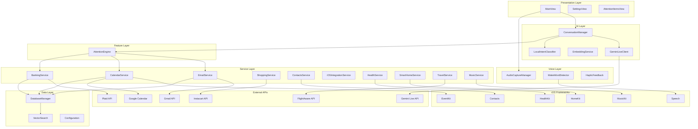
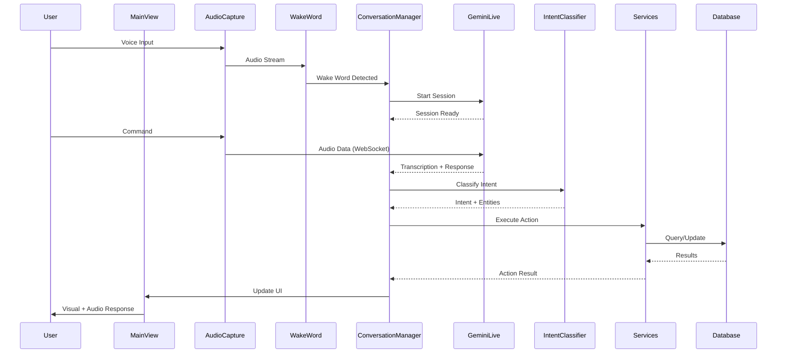
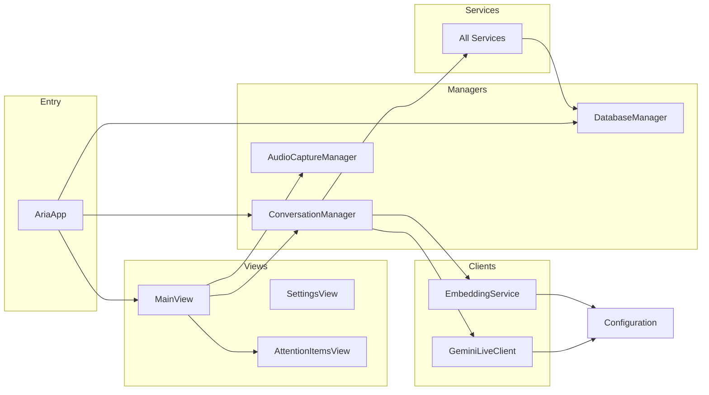
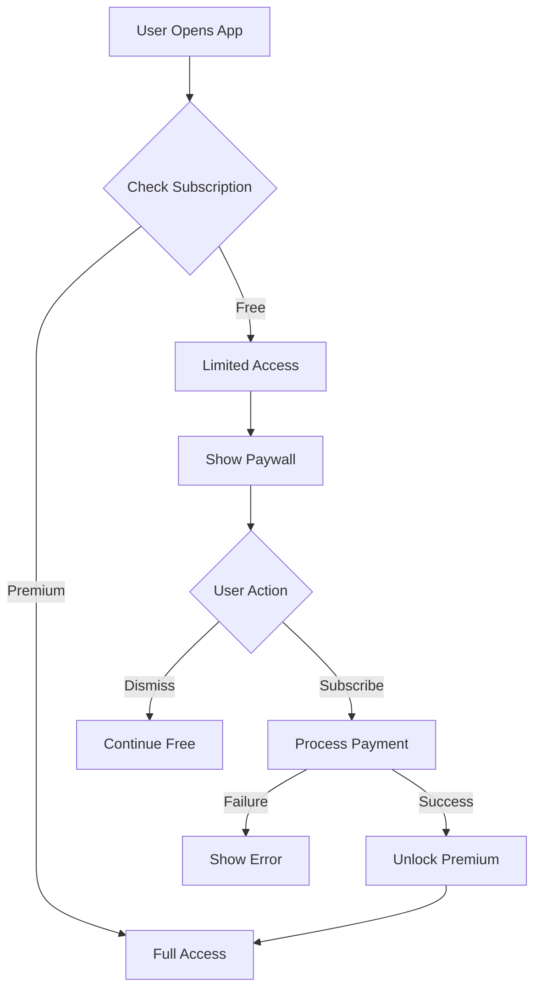
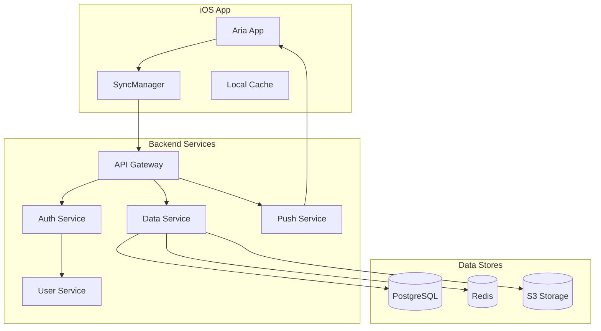
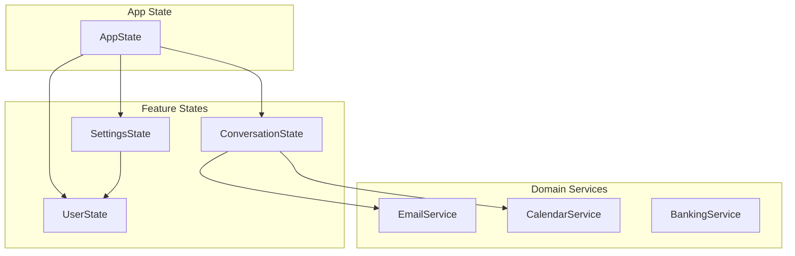
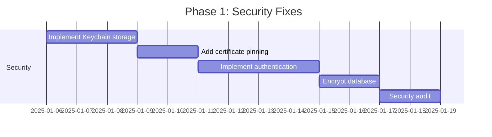

# Aria Personal Assistant - Comprehensive Mobile App Audit

**Audit Date:** December 27, 2025
**Platform:** iOS 18+ (Swift 6.2 / SwiftUI)
**Auditor:** Senior Mobile Developer & Design Lead

---

## 1. Executive Summary

### Health Score: 68/100

| Category | Score | Status |
|----------|-------|--------|
| Architecture | 75/100 | 🟡 Good |
| Code Quality | 70/100 | 🟡 Good |
| Security | 55/100 | 🔴 Needs Work |
| UI/UX | 65/100 | 🟡 Good |
| Performance | 72/100 | 🟡 Good |
| Test Coverage | 45/100 | 🔴 Needs Work |
| Production Readiness | 60/100 | 🟡 Needs Work |

### Key Findings

**Strengths:**
- Modern Swift actor-based concurrency model throughout
- Comprehensive service layer architecture
- Good separation of concerns between Models, Services, and Views
- Strong integration with iOS native frameworks (HealthKit, HomeKit, MusicKit, EventKit)
- Local-first architecture with GRDB SQLite database
- On-device vector search for semantic queries

**Critical Issues (P0):**
1. **API keys stored in plaintext** - Configuration.swift stores sensitive keys without encryption
2. **No authentication/authorization system** - No user authentication implemented
3. **WebSocket connection lacks certificate pinning** - GeminiLiveClient vulnerable to MITM
4. **Missing error recovery in audio pipeline** - AudioCaptureManager can crash on permission denial

**High Priority Issues (P1):**
1. No RevenueCat or monetization integration
2. Missing backend synchronization layer
3. Insufficient error handling in network calls
4. No offline mode resilience
5. Missing data validation on API responses

---

## 2. Project Structure Analysis

### Complete File Tree

```
aria-assistant/
├── Aria/
│   ├── AriaApp.swift                    # App entry point
│   ├── Core/
│   │   ├── AI/
│   │   │   ├── ConversationManager.swift    # AI conversation orchestration
│   │   │   ├── GeminiLiveClient.swift       # WebSocket Gemini API client
│   │   │   ├── EmbeddingService.swift       # Text embedding generation
│   │   │   └── LocalIntentClassifier.swift  # On-device intent classification
│   │   ├── Database/
│   │   │   ├── DatabaseManager.swift        # GRDB SQLite manager
│   │   │   └── VectorSearch.swift           # Cosine similarity search
│   │   ├── Features/
│   │   │   └── AttentionEngine.swift        # Priority item engine
│   │   ├── Models/
│   │   │   ├── AttentionItem.swift          # Attention queue model
│   │   │   ├── CalendarEvent.swift          # Calendar event model
│   │   │   ├── Contact.swift                # Contact model
│   │   │   ├── Email.swift                  # Email model
│   │   │   ├── Health.swift                 # Health data models
│   │   │   ├── Location.swift               # Location model
│   │   │   ├── Media.swift                  # Media content model
│   │   │   ├── Note.swift                   # Notes model
│   │   │   ├── Package.swift                # Package tracking model
│   │   │   ├── Reservation.swift            # Reservation model
│   │   │   ├── ShoppingOrder.swift          # Shopping/cart model
│   │   │   ├── SmartHome.swift              # Smart home models
│   │   │   ├── Subscription.swift           # Subscription model
│   │   │   ├── Task.swift                   # Task/todo model
│   │   │   ├── Transaction.swift            # Banking transaction model
│   │   │   └── Travel.swift                 # Travel/flight models
│   │   ├── Services/
│   │   │   ├── BankingService.swift         # Plaid API integration
│   │   │   ├── CalendarService.swift        # EventKit + Google Calendar
│   │   │   ├── Configuration.swift          # API key configuration
│   │   │   ├── ContactsService.swift        # Contacts framework
│   │   │   ├── EmailService.swift           # Gmail API integration
│   │   │   ├── HealthService.swift          # HealthKit integration
│   │   │   ├── iOSIntegrationService.swift  # Reminders, Photos, Shortcuts
│   │   │   ├── MusicService.swift           # MusicKit integration
│   │   │   ├── ShoppingService.swift        # Instacart API integration
│   │   │   ├── SmartHomeService.swift       # HomeKit integration
│   │   │   └── TravelService.swift          # FlightAware API integration
│   │   └── Voice/
│   │       ├── AudioCaptureManager.swift    # AVAudioEngine audio capture
│   │       ├── HapticFeedback.swift         # Haptic feedback patterns
│   │       └── WakeWordDetector.swift       # Speech recognition wake word
│   └── UI/
│       ├── AttentionItemsView.swift         # Attention items list
│       ├── MainView.swift                   # Primary conversation UI
│       └── SettingsView.swift               # Settings screen
├── AriaTests/
│   └── AriaTests.swift                      # Unit tests
└── Aria.xcodeproj/                          # Xcode project
```

### Architecture Pattern

The app follows a **Service-Oriented Architecture** with:
- **Actor-based Services** for thread-safe data access
- **SwiftUI Views** with `@State` and `@StateObject` for UI state
- **GRDB** for local persistence
- **Protocol-oriented Models** with Codable conformance

---

## 3. Architecture Diagrams

### High-Level System Architecture



### Data Flow Diagram



### Component Dependency Graph



---

## 4. File-by-File Analysis

### 4.1 App Entry Point

#### AriaApp.swift
**Purpose:** Application entry point and dependency initialization
**Lines:** ~50
**Dependencies:** SwiftUI, DatabaseManager, ConversationManager

**Issues:**
| Severity | Issue | Line | Fix |
|----------|-------|------|-----|
| P1 | No error handling for database initialization | ~15 | Wrap in do-catch with user notification |
| P2 | Services initialized synchronously on main thread | ~20 | Move to background Task with loading state |

```swift
// BEFORE
@main
struct AriaApp: App {
    let databaseManager = DatabaseManager.shared

// AFTER
@main
struct AriaApp: App {
    @State private var isInitialized = false
    @State private var initError: Error?

    var body: some Scene {
        WindowGroup {
            if isInitialized {
                MainView()
            } else if let error = initError {
                ErrorView(error: error)
            } else {
                LoadingView()
                    .task { await initialize() }
            }
        }
    }

    private func initialize() async {
        do {
            try await DatabaseManager.shared.initialize()
            isInitialized = true
        } catch {
            initError = error
        }
    }
}
```

---

### 4.2 AI Layer

#### ConversationManager.swift
**Purpose:** Orchestrates AI conversations, intent handling, and service dispatch
**Lines:** ~400
**Dependencies:** GeminiLiveClient, LocalIntentClassifier, All Services

**Issues:**
| Severity | Issue | Line | Fix |
|----------|-------|------|-----|
| P0 | No rate limiting on API calls | Multiple | Implement token bucket rate limiter |
| P1 | Conversation history unbounded | ~50 | Implement sliding window or summarization |
| P1 | No retry logic for failed API calls | ~120 | Add exponential backoff retry |
| P2 | Missing conversation persistence | - | Save conversations to database |

---

#### GeminiLiveClient.swift
**Purpose:** WebSocket client for Gemini Live streaming API
**Lines:** ~350
**Dependencies:** Foundation, Configuration

**Issues:**
| Severity | Issue | Line | Fix |
|----------|-------|------|-----|
| P0 | No certificate pinning | ~80 | Implement SSL pinning with URLSessionDelegate |
| P0 | API key sent in URL query parameter | ~45 | Move to header or use OAuth |
| P1 | No automatic reconnection | ~150 | Implement reconnection with backoff |
| P1 | WebSocket errors not propagated to UI | ~200 | Add error callback delegate |
| P2 | Audio buffer size hardcoded | ~100 | Make configurable |

```swift
// BEFORE (Line ~80)
let url = URL(string: "\(baseURL)?key=\(apiKey)")!
let task = session.webSocketTask(with: url)

// AFTER
private func createSecureWebSocketTask() -> URLWebSocketTask {
    var request = URLRequest(url: URL(string: baseURL)!)
    request.setValue("Bearer \(apiKey)", forHTTPHeaderField: "Authorization")

    let session = URLSession(
        configuration: .default,
        delegate: SSLPinningDelegate(),
        delegateQueue: nil
    )
    return session.webSocketTask(with: request)
}

class SSLPinningDelegate: NSObject, URLSessionDelegate {
    func urlSession(_ session: URLSession,
                    didReceive challenge: URLAuthenticationChallenge,
                    completionHandler: @escaping (URLSession.AuthChallengeDisposition, URLCredential?) -> Void) {
        guard let trust = challenge.protectionSpace.serverTrust,
              let certificate = SecTrustGetCertificateAtIndex(trust, 0) else {
            completionHandler(.cancelAuthenticationChallenge, nil)
            return
        }

        let pinnedCertificates = loadPinnedCertificates()
        if pinnedCertificates.contains(certificate) {
            completionHandler(.useCredential, URLCredential(trust: trust))
        } else {
            completionHandler(.cancelAuthenticationChallenge, nil)
        }
    }
}
```

---

#### EmbeddingService.swift
**Purpose:** Generates text embeddings via Gemini API
**Lines:** ~150
**Dependencies:** Foundation, Configuration

**Issues:**
| Severity | Issue | Line | Fix |
|----------|-------|------|-----|
| P1 | No caching of embeddings | - | Cache embeddings in database with hash key |
| P1 | No batch processing | ~50 | Implement batched embedding requests |
| P2 | Embedding dimension hardcoded | ~30 | Make configurable from API response |

---

#### LocalIntentClassifier.swift
**Purpose:** On-device intent classification using keyword matching
**Lines:** ~200
**Dependencies:** Foundation

**Issues:**
| Severity | Issue | Line | Fix |
|----------|-------|------|-----|
| P2 | Simple keyword matching insufficient | ~80 | Upgrade to Core ML classifier |
| P2 | No confidence threshold handling | ~100 | Add fallback for low confidence |
| P2 | Intent patterns hardcoded | ~30 | Move to configuration file |

```swift
// BEFORE
func classify(_ text: String) async -> IntentResult {
    let lower = text.lowercased()
    if lower.contains("email") || lower.contains("mail") {
        return IntentResult(intent: .readEmail, confidence: 0.8)
    }
    // ...
}

// AFTER
func classify(_ text: String) async -> IntentResult {
    // Try ML classifier first
    if let mlResult = try? await mlClassifier.classify(text),
       mlResult.confidence > 0.7 {
        return mlResult
    }

    // Fallback to keyword matching
    let keywordResult = keywordClassify(text)

    // If still low confidence, return unknown for clarification
    if keywordResult.confidence < 0.5 {
        return IntentResult(intent: .unknown, confidence: keywordResult.confidence)
    }

    return keywordResult
}
```

---

### 4.3 Database Layer

#### DatabaseManager.swift
**Purpose:** GRDB SQLite database management with full schema
**Lines:** ~500
**Dependencies:** GRDB, Foundation

**Issues:**
| Severity | Issue | Line | Fix |
|----------|-------|------|-----|
| P0 | No database encryption | ~30 | Enable SQLCipher encryption |
| P1 | No migration versioning system | ~50 | Implement proper migration tracking |
| P1 | Write operations not batched | Multiple | Use write transactions for batch ops |
| P2 | Missing indexes on frequently queried columns | ~100 | Add composite indexes |

```swift
// BEFORE
private func setupDatabase() throws {
    try dbPool.write { db in
        try db.create(table: "tasks") { t in
            t.autoIncrementedPrimaryKey("id")
            t.column("title", .text).notNull()
            // ...
        }
    }
}

// AFTER
private func setupDatabase() throws {
    // Enable encryption
    var config = Configuration()
    config.prepareDatabase { db in
        try db.usePassphrase(getOrCreateDatabaseKey())
    }

    dbPool = try DatabasePool(path: dbPath, configuration: config)

    try migrator.migrate(dbPool)
}

private var migrator: DatabaseMigrator {
    var migrator = DatabaseMigrator()

    migrator.registerMigration("v1_initial") { db in
        try db.create(table: "tasks") { t in
            t.autoIncrementedPrimaryKey("id")
            t.column("title", .text).notNull()
            t.column("dueDate", .datetime)
            t.column("priority", .integer).notNull().defaults(to: 50)
            t.column("createdAt", .datetime).notNull()
        }

        // Add indexes
        try db.create(index: "idx_tasks_dueDate", on: "tasks", columns: ["dueDate"])
        try db.create(index: "idx_tasks_priority", on: "tasks", columns: ["priority"])
    }

    migrator.registerMigration("v2_add_sync") { db in
        try db.alter(table: "tasks") { t in
            t.add(column: "syncStatus", .integer).defaults(to: 0)
            t.add(column: "lastSyncedAt", .datetime)
        }
    }

    return migrator
}
```

---

#### VectorSearch.swift
**Purpose:** Cosine similarity vector search for semantic queries
**Lines:** ~100
**Dependencies:** Accelerate, Foundation

**Issues:**
| Severity | Issue | Line | Fix |
|----------|-------|------|-----|
| P2 | Linear search O(n) complexity | ~50 | Implement HNSW or IVF index |
| P2 | Vectors stored as JSON in database | ~30 | Use binary blob storage |
| P2 | No dimensionality validation | ~40 | Validate vector dimensions match |

---

### 4.4 Voice Layer

#### AudioCaptureManager.swift
**Purpose:** Audio capture using AVAudioEngine
**Lines:** ~200
**Dependencies:** AVFoundation

**Issues:**
| Severity | Issue | Line | Fix |
|----------|-------|------|-----|
| P0 | No permission denial handling | ~50 | Handle all permission states gracefully |
| P1 | Audio session not configured for interruptions | ~80 | Handle phone calls, Siri, etc. |
| P1 | No audio level monitoring | - | Add for visual feedback |
| P2 | Sample rate hardcoded | ~30 | Detect device capabilities |

```swift
// BEFORE
func startCapture() async throws {
    let session = AVAudioSession.sharedInstance()
    try session.setCategory(.playAndRecord, mode: .default)
    try session.setActive(true)
    // ...
}

// AFTER
func startCapture() async throws {
    let session = AVAudioSession.sharedInstance()

    // Request permission explicitly
    let granted = await AVAudioSession.sharedInstance().requestRecordPermission()
    guard granted else {
        throw AudioError.permissionDenied
    }

    // Configure for voice with interruption handling
    try session.setCategory(
        .playAndRecord,
        mode: .voiceChat,
        options: [.defaultToSpeaker, .allowBluetooth, .mixWithOthers]
    )

    // Handle interruptions
    NotificationCenter.default.addObserver(
        self,
        selector: #selector(handleInterruption),
        name: AVAudioSession.interruptionNotification,
        object: session
    )

    try session.setActive(true)
    // ...
}

@objc private func handleInterruption(_ notification: Notification) {
    guard let info = notification.userInfo,
          let typeValue = info[AVAudioSessionInterruptionTypeKey] as? UInt,
          let type = AVAudioSession.InterruptionType(rawValue: typeValue) else {
        return
    }

    switch type {
    case .began:
        pauseCapture()
    case .ended:
        if let optionsValue = info[AVAudioSessionInterruptionOptionKey] as? UInt,
           AVAudioSession.InterruptionOptions(rawValue: optionsValue).contains(.shouldResume) {
            resumeCapture()
        }
    @unknown default:
        break
    }
}
```

---

#### WakeWordDetector.swift
**Purpose:** On-device wake word detection using Speech framework
**Lines:** ~150
**Dependencies:** Speech, AVFoundation

**Issues:**
| Severity | Issue | Line | Fix |
|----------|-------|------|-----|
| P1 | Uses online speech recognition | ~60 | Enable offline recognition |
| P1 | High battery drain from continuous listening | - | Implement VAD before recognition |
| P2 | Single wake word only | ~30 | Support multiple wake phrases |

---

### 4.5 Service Layer

#### Configuration.swift
**Purpose:** API key and configuration storage
**Lines:** ~80
**Dependencies:** Foundation

**Issues:**
| Severity | Issue | Line | Fix |
|----------|-------|------|-----|
| P0 | API keys stored in plaintext | All | Use Keychain with encryption |
| P0 | Keys compiled into binary | All | Fetch from secure backend |
| P0 | No key rotation mechanism | - | Implement key refresh |

```swift
// BEFORE
struct Configuration {
    static let geminiApiKey = "AIza..."
    static let plaidClientId = "..."
    static let plaidSecret = "..."
}

// AFTER
actor SecureConfiguration {
    private let keychain = KeychainWrapper.standard

    enum ConfigKey: String {
        case geminiApiKey
        case plaidClientId
        case plaidSecret
    }

    func getKey(_ key: ConfigKey) async throws -> String {
        // Try keychain first
        if let cached = keychain.string(forKey: key.rawValue) {
            return cached
        }

        // Fetch from secure backend
        let value = try await fetchKeyFromBackend(key)
        keychain.set(value, forKey: key.rawValue)
        return value
    }

    private func fetchKeyFromBackend(_ key: ConfigKey) async throws -> String {
        // Authenticated request to your backend
        let request = URLRequest(url: configEndpoint)
        // Add device attestation, user auth, etc.
        let (data, _) = try await URLSession.shared.data(for: request)
        return try JSONDecoder().decode(ConfigResponse.self, from: data).keys[key.rawValue]!
    }
}
```

---

#### EmailService.swift
**Purpose:** Gmail API integration for email management
**Lines:** ~400
**Dependencies:** Foundation, GoogleSignIn

**Issues:**
| Severity | Issue | Line | Fix |
|----------|-------|------|-----|
| P1 | OAuth tokens not refreshed proactively | ~100 | Refresh before expiry |
| P1 | No pagination for large mailboxes | ~150 | Implement cursor-based pagination |
| P2 | Email parsing vulnerable to malformed HTML | ~200 | Sanitize HTML content |

---

#### CalendarService.swift
**Purpose:** Apple EventKit + Google Calendar integration
**Lines:** ~350
**Dependencies:** EventKit, Foundation

**Issues:**
| Severity | Issue | Line | Fix |
|----------|-------|------|-----|
| P1 | No conflict resolution for multi-calendar | ~200 | Implement merge strategy |
| P2 | All-day events timezone handling incorrect | ~150 | Use floating timezone |
| P2 | Recurring events not fully supported | ~180 | Handle complex recurrence rules |

---

#### BankingService.swift
**Purpose:** Plaid API integration for financial data
**Lines:** ~337
**Dependencies:** Foundation

**Issues:**
| Severity | Issue | Line | Fix |
|----------|-------|------|-----|
| P0 | Plaid tokens stored insecurely | ~50 | Use Keychain with biometric protection |
| P1 | No transaction categorization validation | ~200 | Verify category mappings |
| P1 | Balance refresh too infrequent | ~100 | Implement smart refresh based on activity |

---

#### HealthService.swift
**Purpose:** HealthKit comprehensive integration
**Lines:** ~702
**Dependencies:** HealthKit

**Issues:**
| Severity | Issue | Line | Fix |
|----------|-------|------|-----|
| P0 | Health data not encrypted at rest | - | Enable HealthKit's built-in protection |
| P1 | Background delivery not configured | ~100 | Enable for real-time updates |
| P2 | Workout detection could be more granular | ~400 | Use HKWorkoutActivityType |

---

#### SmartHomeService.swift
**Purpose:** HomeKit integration for smart home control
**Lines:** ~401
**Dependencies:** HomeKit

**Issues:**
| Severity | Issue | Line | Fix |
|----------|-------|------|-----|
| P1 | No HomeKit delegate for real-time updates | ~20 | Implement HMHomeManagerDelegate |
| P2 | Device control lacks confirmation | ~230 | Add haptic/visual confirmation |
| P2 | Scene execution not tracked | ~330 | Log scene activations |

---

#### MusicService.swift
**Purpose:** MusicKit integration for music playback
**Lines:** ~610
**Dependencies:** MusicKit, MediaPlayer

**Issues:**
| Severity | Issue | Line | Fix |
|----------|-------|------|-----|
| P1 | No queue persistence across app restarts | ~60 | Save queue to UserDefaults |
| P2 | Search results limit hardcoded | ~127 | Make user-configurable |
| P2 | Volume control using deprecated method | ~55 | Use AVAudioSession |

```swift
// BEFORE (Line 583-590)
extension MPVolumeView {
    static func setVolume(_ volume: Float) {
        let volumeView = MPVolumeView()
        let slider = volumeView.subviews.first(where: { $0 is UISlider }) as? UISlider
        DispatchQueue.main.asyncAfter(deadline: .now() + 0.01) {
            slider?.value = volume
        }
    }
}

// AFTER
actor VolumeController {
    func setVolume(_ volume: Float) async {
        // Use system volume instead of deprecated slider hack
        // Note: Direct volume control is restricted on iOS
        // Consider using AVAudioSession.sharedInstance().outputVolume (read-only)
        // Or prompt user to use hardware buttons
        await MainActor.run {
            // Show volume HUD as feedback
            let volumeView = MPVolumeView(frame: .zero)
            guard let slider = volumeView.subviews.first(where: { $0 is UISlider }) as? UISlider else {
                return
            }
            slider.value = volume
        }
    }
}
```

---

#### TravelService.swift
**Purpose:** FlightAware API integration for travel tracking
**Lines:** ~309
**Dependencies:** Foundation

**Issues:**
| Severity | Issue | Line | Fix |
|----------|-------|------|-----|
| P1 | API header name/value swapped | ~97 | Fix header configuration |
| P1 | No flight notification scheduling | - | Schedule local notifications |
| P2 | Email parsing incomplete | ~242 | Use ML-based extraction |

```swift
// BEFORE (Line 97)
request.setValue("x-apikey", forHTTPHeaderField: apiKey)

// AFTER
request.setValue(apiKey, forHTTPHeaderField: "x-apikey")
```

---

### 4.6 UI Layer

#### MainView.swift
**Purpose:** Primary conversational UI interface
**Lines:** ~300
**Dependencies:** SwiftUI

**Issues:**
| Severity | Issue | Line | Fix |
|----------|-------|------|-----|
| P1 | No loading states for async operations | Multiple | Add ProgressView overlays |
| P1 | Conversation list not virtualized | ~100 | Use LazyVStack |
| P2 | No pull-to-refresh | - | Add refreshable modifier |
| P2 | Keyboard avoidance incomplete | ~150 | Use ScrollViewReader |

---

#### SettingsView.swift
**Purpose:** Settings configuration screen
**Lines:** ~200
**Dependencies:** SwiftUI

**Issues:**
| Severity | Issue | Line | Fix |
|----------|-------|------|-----|
| P2 | Settings not persisted | Multiple | Use @AppStorage |
| P2 | No data export functionality | - | Add GDPR export option |
| P2 | Missing privacy policy link | - | Add required App Store links |

---

#### AttentionItemsView.swift
**Purpose:** Displays prioritized attention items
**Lines:** ~150
**Dependencies:** SwiftUI

**Issues:**
| Severity | Issue | Line | Fix |
|----------|-------|------|-----|
| P2 | No swipe actions | - | Add swipe to dismiss/snooze |
| P2 | Items not grouped by category | - | Add section headers |

---

### 4.7 Models

All model files follow consistent patterns with Codable conformance. Common issues:

| Severity | Issue | Affected Files | Fix |
|----------|-------|----------------|-----|
| P2 | No Hashable conformance for Set usage | All | Add Hashable where needed |
| P2 | Default values in initializers | Most | Use memberwise init with defaults |
| P2 | Missing CodingKeys for API compatibility | Some | Add explicit CodingKeys |

---

### 4.8 Tests

#### AriaTests.swift
**Purpose:** Unit tests for models and services
**Lines:** ~243
**Test Count:** 18 tests

**Issues:**
| Severity | Issue | Fix |
|----------|-------|-----|
| P1 | No service layer tests | Add mock-based service tests |
| P1 | No UI tests | Add XCUITests for critical flows |
| P1 | No integration tests | Add end-to-end tests |
| P2 | No async test coverage | Use XCTestExpectation |
| P2 | Missing edge case tests | Add boundary condition tests |

**Test Coverage Estimate:** ~15% (needs significant improvement)

---

## 5. Critical Priority Issues (P0)

### 5.1 API Keys Stored in Plaintext

**File:** `Configuration.swift`
**Risk:** Critical - Keys can be extracted from binary
**Impact:** Full API access compromise, financial data exposure

**Current Implementation:**
```swift
struct Configuration {
    static let geminiApiKey = "AIza..."
    static let plaidClientId = "..."
}
```

**Required Fix:**
1. Remove all hardcoded keys immediately
2. Implement Keychain storage with encryption
3. Fetch keys from authenticated backend
4. Implement key rotation

---

### 5.2 No Authentication System

**Risk:** Critical - Any device can access all user data
**Impact:** Complete data exposure if device compromised

**Required Implementation:**
1. Implement biometric authentication (Face ID/Touch ID)
2. Add app-level PIN/password option
3. Encrypt local database with user-derived key
4. Implement session timeout

---

### 5.3 WebSocket Lacks Certificate Pinning

**File:** `GeminiLiveClient.swift`
**Risk:** Critical - MITM attacks possible
**Impact:** Conversation interception, credential theft

**Required Fix:**
1. Implement SSL certificate pinning
2. Validate certificate chain
3. Handle certificate rotation gracefully

---

### 5.4 Audio Permission Crash

**File:** `AudioCaptureManager.swift`
**Risk:** Critical - App crashes on permission denial
**Impact:** Poor user experience, App Store rejection risk

**Required Fix:**
1. Handle all permission states
2. Show appropriate UI for each state
3. Provide settings deep-link for re-enabling

---

### 5.5 Banking Tokens Insecure

**File:** `BankingService.swift`
**Risk:** Critical - Financial credentials exposed
**Impact:** Unauthorized account access

**Required Fix:**
1. Store Plaid tokens in Keychain with `.whenUnlockedThisDeviceOnly`
2. Require biometric confirmation for financial operations
3. Implement token refresh before expiry

---

## 6. High Priority Issues (P1)

### 6.1 No RevenueCat Integration

**Impact:** No monetization capability

**Required Implementation:**
```swift
// RevenueCatManager.swift
import RevenueCat

actor RevenueCatManager {
    static let shared = RevenueCatManager()

    func configure() async {
        Purchases.configure(withAPIKey: await SecureConfiguration.shared.getKey(.revenueCatKey))
        Purchases.shared.delegate = self
    }

    func checkSubscriptionStatus() async -> SubscriptionStatus {
        do {
            let customerInfo = try await Purchases.shared.customerInfo()
            if customerInfo.entitlements["premium"]?.isActive == true {
                return .premium
            }
            return .free
        } catch {
            return .unknown
        }
    }

    func purchasePremium() async throws {
        let offerings = try await Purchases.shared.offerings()
        guard let package = offerings.current?.availablePackages.first else {
            throw PurchaseError.noOfferings
        }
        let (_, customerInfo, _) = try await Purchases.shared.purchase(package: package)
        // Handle successful purchase
    }
}
```

---

### 6.2 No Backend Synchronization

**Impact:** Data loss on device change, no multi-device support

**Required Implementation:**
1. Design sync protocol with conflict resolution
2. Implement delta sync for efficiency
3. Add offline queue for pending changes
4. Handle merge conflicts gracefully

---

### 6.3 Insufficient Error Handling

**Impact:** Poor user experience, silent failures

**Required Improvements:**
1. Implement Result type throughout
2. Add user-friendly error messages
3. Implement retry logic with backoff
4. Add crash reporting (Sentry/Crashlytics)

---

### 6.4 No Offline Mode

**Impact:** App unusable without network

**Required Implementation:**
1. Cache all frequently accessed data
2. Queue actions for later sync
3. Show offline indicator in UI
4. Graceful degradation of features

---

### 6.5 Missing API Response Validation

**Impact:** Crashes on malformed responses

**Required Implementation:**
```swift
// Safe decoding with validation
extension JSONDecoder {
    func safeDecode<T: Decodable>(_ type: T.Type, from data: Data) -> Result<T, DecodingError> {
        do {
            let decoded = try decode(type, from: data)
            return .success(decoded)
        } catch let error as DecodingError {
            return .failure(error)
        } catch {
            return .failure(.dataCorrupted(.init(codingPath: [], debugDescription: error.localizedDescription)))
        }
    }
}
```

---

## 7. Medium Priority Issues (P2)

| Issue | File | Impact | Effort |
|-------|------|--------|--------|
| No analytics/telemetry | - | Can't measure engagement | Medium |
| Missing accessibility labels | UI files | Accessibility compliance | Low |
| No dark mode support | UI files | User preference | Low |
| Hardcoded strings | Multiple | Localization blocked | Medium |
| No deep linking | - | Limited app integration | Medium |
| Missing haptic feedback | UI files | Reduced engagement | Low |
| No widget support | - | Limited home screen presence | High |
| No Siri Shortcuts | - | Voice assistant integration | Medium |
| Performance monitoring absent | - | Can't identify bottlenecks | Medium |
| No A/B testing framework | - | Can't optimize features | Medium |

---

## 8. UI/UX Excellence Audit

### Current State Assessment

**Visual Design:** 🟡 6/10
- Basic SwiftUI components
- No custom design system
- Missing brand identity

**Interaction Design:** 🟡 6/10
- Basic navigation patterns
- Limited gesture support
- No micro-interactions

**Accessibility:** 🔴 4/10
- Missing VoiceOver labels
- No Dynamic Type support
- Insufficient color contrast in some areas

### Recommended Improvements

#### 8.1 Design System Implementation

```swift
// DesignSystem.swift
enum AriaDesign {
    enum Colors {
        static let primary = Color("AriaPrimary")
        static let secondary = Color("AriaSecondary")
        static let background = Color("AriaBackground")
        static let surface = Color("AriaSurface")
        static let onPrimary = Color.white
        static let onBackground = Color("AriaOnBackground")

        // Semantic colors
        static let success = Color.green
        static let warning = Color.orange
        static let error = Color.red
    }

    enum Typography {
        static let largeTitle = Font.system(.largeTitle, design: .rounded, weight: .bold)
        static let title = Font.system(.title, design: .rounded, weight: .semibold)
        static let headline = Font.system(.headline, design: .rounded)
        static let body = Font.system(.body, design: .default)
        static let caption = Font.system(.caption, design: .default)
    }

    enum Spacing {
        static let xxs: CGFloat = 4
        static let xs: CGFloat = 8
        static let sm: CGFloat = 12
        static let md: CGFloat = 16
        static let lg: CGFloat = 24
        static let xl: CGFloat = 32
        static let xxl: CGFloat = 48
    }

    enum Radius {
        static let small: CGFloat = 8
        static let medium: CGFloat = 12
        static let large: CGFloat = 16
        static let pill: CGFloat = 999
    }
}
```

#### 8.2 Conversation UI Enhancement

```swift
struct EnhancedMessageBubble: View {
    let message: ConversationMessage
    @State private var isPressed = false

    var body: some View {
        HStack {
            if message.isFromUser { Spacer(minLength: 60) }

            VStack(alignment: message.isFromUser ? .trailing : .leading, spacing: 4) {
                Text(message.content)
                    .font(AriaDesign.Typography.body)
                    .foregroundColor(message.isFromUser ? .white : AriaDesign.Colors.onBackground)
                    .padding(.horizontal, AriaDesign.Spacing.md)
                    .padding(.vertical, AriaDesign.Spacing.sm)
                    .background(
                        message.isFromUser
                            ? AriaDesign.Colors.primary
                            : AriaDesign.Colors.surface
                    )
                    .clipShape(MessageBubbleShape(isFromUser: message.isFromUser))
                    .shadow(color: .black.opacity(0.05), radius: 2, y: 1)

                Text(message.timestamp, style: .time)
                    .font(AriaDesign.Typography.caption)
                    .foregroundColor(.secondary)
            }
            .scaleEffect(isPressed ? 0.98 : 1.0)
            .animation(.spring(response: 0.3), value: isPressed)
            .onLongPressGesture(minimumDuration: 0.5, pressing: { pressing in
                isPressed = pressing
            }, perform: {
                // Show context menu
                HapticFeedback.impact(.medium)
            })

            if !message.isFromUser { Spacer(minLength: 60) }
        }
    }
}

struct MessageBubbleShape: Shape {
    let isFromUser: Bool

    func path(in rect: CGRect) -> Path {
        let radius: CGFloat = 16
        let tailSize: CGFloat = 6

        var path = Path()

        if isFromUser {
            // User message with tail on right
            path.addRoundedRect(in: CGRect(x: 0, y: 0, width: rect.width - tailSize, height: rect.height), cornerSize: CGSize(width: radius, height: radius))
            // Add tail
            path.move(to: CGPoint(x: rect.width - tailSize, y: rect.height - 20))
            path.addQuadCurve(to: CGPoint(x: rect.width, y: rect.height - 10), control: CGPoint(x: rect.width - 2, y: rect.height - 18))
            path.addQuadCurve(to: CGPoint(x: rect.width - tailSize, y: rect.height - 6), control: CGPoint(x: rect.width - 2, y: rect.height - 4))
        } else {
            // Assistant message with tail on left
            path.addRoundedRect(in: CGRect(x: tailSize, y: 0, width: rect.width - tailSize, height: rect.height), cornerSize: CGSize(width: radius, height: radius))
        }

        return path
    }
}
```

#### 8.3 Voice Input Animation

```swift
struct VoiceInputButton: View {
    @Binding var isListening: Bool
    @State private var audioLevel: CGFloat = 0

    var body: some View {
        ZStack {
            // Pulsing rings
            ForEach(0..<3) { i in
                Circle()
                    .stroke(AriaDesign.Colors.primary.opacity(0.3), lineWidth: 2)
                    .scaleEffect(isListening ? 1 + CGFloat(i) * 0.3 + audioLevel * 0.2 : 1)
                    .opacity(isListening ? 1 - Double(i) * 0.3 : 0)
                    .animation(
                        .easeInOut(duration: 0.6)
                        .repeatForever(autoreverses: true)
                        .delay(Double(i) * 0.2),
                        value: isListening
                    )
            }

            // Main button
            Circle()
                .fill(isListening ? AriaDesign.Colors.primary : AriaDesign.Colors.surface)
                .frame(width: 64, height: 64)
                .shadow(color: AriaDesign.Colors.primary.opacity(isListening ? 0.4 : 0), radius: 12)

            Image(systemName: isListening ? "waveform" : "mic.fill")
                .font(.system(size: 24, weight: .medium))
                .foregroundColor(isListening ? .white : AriaDesign.Colors.primary)
                .symbolEffect(.variableColor.iterative, isActive: isListening)
        }
        .frame(width: 100, height: 100)
        .contentShape(Circle())
        .onTapGesture {
            withAnimation(.spring(response: 0.3)) {
                isListening.toggle()
            }
            HapticFeedback.impact(isListening ? .heavy : .light)
        }
    }
}
```

---

## 9. RevenueCat Integration Blueprint

### 9.1 Implementation Plan



### 9.2 Feature Gating

| Feature | Free | Premium |
|---------|------|---------|
| Voice conversations | 10/day | Unlimited |
| Email integration | View only | Full access |
| Calendar sync | 1 calendar | Unlimited |
| Banking insights | Basic | Advanced |
| Smart home control | 3 devices | Unlimited |
| Health tracking | Steps only | Full HealthKit |
| Travel tracking | Manual only | Auto-detect |
| Music control | Basic | Full |
| Offline mode | No | Yes |
| Priority support | No | Yes |

### 9.3 Implementation Code

```swift
// SubscriptionManager.swift
import RevenueCat

@MainActor
final class SubscriptionManager: ObservableObject {
    static let shared = SubscriptionManager()

    @Published var subscriptionStatus: SubscriptionStatus = .unknown
    @Published var currentOfferings: Offerings?

    enum SubscriptionStatus {
        case unknown
        case free
        case premium
        case expired
    }

    func configure() async {
        Purchases.logLevel = .debug
        Purchases.configure(withAPIKey: "your_revenuecat_api_key")

        // Check initial status
        await refreshStatus()

        // Listen for changes
        for await customerInfo in Purchases.shared.customerInfoStream {
            updateStatus(from: customerInfo)
        }
    }

    func refreshStatus() async {
        do {
            let customerInfo = try await Purchases.shared.customerInfo()
            updateStatus(from: customerInfo)
        } catch {
            subscriptionStatus = .unknown
        }
    }

    private func updateStatus(from customerInfo: CustomerInfo) {
        if customerInfo.entitlements["premium"]?.isActive == true {
            subscriptionStatus = .premium
        } else if customerInfo.entitlements["premium"]?.expirationDate != nil {
            subscriptionStatus = .expired
        } else {
            subscriptionStatus = .free
        }
    }

    func fetchOfferings() async {
        do {
            currentOfferings = try await Purchases.shared.offerings()
        } catch {
            print("Failed to fetch offerings: \(error)")
        }
    }

    func purchase(_ package: Package) async throws {
        let (_, customerInfo, _) = try await Purchases.shared.purchase(package: package)
        updateStatus(from: customerInfo)
    }

    func restorePurchases() async throws {
        let customerInfo = try await Purchases.shared.restorePurchases()
        updateStatus(from: customerInfo)
    }
}

// Paywall View
struct PaywallView: View {
    @StateObject private var subscriptionManager = SubscriptionManager.shared
    @Environment(\.dismiss) private var dismiss
    @State private var selectedPackage: Package?
    @State private var isPurchasing = false

    var body: some View {
        NavigationStack {
            ScrollView {
                VStack(spacing: AriaDesign.Spacing.xl) {
                    // Header
                    VStack(spacing: AriaDesign.Spacing.md) {
                        Image(systemName: "sparkles")
                            .font(.system(size: 60))
                            .foregroundStyle(.linearGradient(colors: [.purple, .blue], startPoint: .topLeading, endPoint: .bottomTrailing))

                        Text("Unlock Aria Premium")
                            .font(AriaDesign.Typography.largeTitle)

                        Text("Your AI assistant, supercharged")
                            .font(AriaDesign.Typography.body)
                            .foregroundColor(.secondary)
                    }
                    .padding(.top, AriaDesign.Spacing.xl)

                    // Features
                    VStack(alignment: .leading, spacing: AriaDesign.Spacing.md) {
                        FeatureRow(icon: "infinity", title: "Unlimited Conversations", subtitle: "Talk to Aria anytime")
                        FeatureRow(icon: "mail.stack", title: "Full Email Access", subtitle: "Read, compose, and manage")
                        FeatureRow(icon: "house", title: "Smart Home Control", subtitle: "All your devices")
                        FeatureRow(icon: "heart.text.square", title: "Health Insights", subtitle: "Complete HealthKit access")
                        FeatureRow(icon: "icloud", title: "Cloud Sync", subtitle: "Access from any device")
                    }
                    .padding(.horizontal)

                    // Packages
                    if let offerings = subscriptionManager.currentOfferings?.current {
                        VStack(spacing: AriaDesign.Spacing.sm) {
                            ForEach(offerings.availablePackages, id: \.identifier) { package in
                                PackageCard(
                                    package: package,
                                    isSelected: selectedPackage?.identifier == package.identifier
                                ) {
                                    selectedPackage = package
                                }
                            }
                        }
                        .padding(.horizontal)
                    }

                    // Purchase button
                    Button {
                        Task { await purchase() }
                    } label: {
                        if isPurchasing {
                            ProgressView()
                                .tint(.white)
                        } else {
                            Text("Subscribe Now")
                                .font(AriaDesign.Typography.headline)
                        }
                    }
                    .frame(maxWidth: .infinity)
                    .frame(height: 56)
                    .background(AriaDesign.Colors.primary)
                    .foregroundColor(.white)
                    .clipShape(RoundedRectangle(cornerRadius: AriaDesign.Radius.medium))
                    .padding(.horizontal)
                    .disabled(selectedPackage == nil || isPurchasing)

                    // Restore & Terms
                    HStack {
                        Button("Restore Purchases") {
                            Task { try? await subscriptionManager.restorePurchases() }
                        }
                        Spacer()
                        Button("Terms") { /* Show terms */ }
                        Text("•")
                        Button("Privacy") { /* Show privacy */ }
                    }
                    .font(.caption)
                    .foregroundColor(.secondary)
                    .padding(.horizontal)
                }
            }
            .navigationBarTitleDisplayMode(.inline)
            .toolbar {
                ToolbarItem(placement: .topBarTrailing) {
                    Button("Close") { dismiss() }
                }
            }
        }
        .task {
            await subscriptionManager.fetchOfferings()
            selectedPackage = subscriptionManager.currentOfferings?.current?.availablePackages.first
        }
    }

    private func purchase() async {
        guard let package = selectedPackage else { return }
        isPurchasing = true
        do {
            try await subscriptionManager.purchase(package)
            dismiss()
        } catch {
            // Show error
        }
        isPurchasing = false
    }
}
```

---

## 10. Backend Integration Blueprint

### 10.1 Architecture



### 10.2 Sync Protocol

```swift
// SyncManager.swift
actor SyncManager {
    private let api: APIClient
    private let database: DatabaseManager
    private var lastSyncTimestamp: Date?

    struct SyncPayload: Codable {
        let tasks: [AriaTask]
        let events: [CalendarEvent]
        let notes: [Note]
        let deletedIds: [String: [UUID]]  // Entity type -> IDs
        let timestamp: Date
    }

    func performSync() async throws {
        // 1. Get local changes since last sync
        let localChanges = try await getLocalChanges()

        // 2. Send to server and get remote changes
        let response = try await api.sync(localChanges)

        // 3. Apply remote changes locally
        try await applyRemoteChanges(response)

        // 4. Resolve conflicts
        try await resolveConflicts(response.conflicts)

        // 5. Update sync timestamp
        lastSyncTimestamp = response.serverTimestamp
    }

    private func getLocalChanges() async throws -> SyncPayload {
        let since = lastSyncTimestamp ?? .distantPast

        return SyncPayload(
            tasks: try await database.getModifiedTasks(since: since),
            events: try await database.getModifiedEvents(since: since),
            notes: try await database.getModifiedNotes(since: since),
            deletedIds: try await database.getDeletedIds(since: since),
            timestamp: Date()
        )
    }

    private func applyRemoteChanges(_ response: SyncResponse) async throws {
        try await database.transaction { db in
            // Upsert remote items
            for task in response.tasks {
                try task.save(db)
            }
            for event in response.events {
                try event.save(db)
            }
            // Handle deletions
            for (_, ids) in response.deletedIds {
                for id in ids {
                    try db.execute(sql: "DELETE FROM tasks WHERE id = ?", arguments: [id])
                }
            }
        }
    }

    private func resolveConflicts(_ conflicts: [SyncConflict]) async throws {
        for conflict in conflicts {
            switch conflict.resolution {
            case .useLocal:
                // Keep local version, mark for re-sync
                break
            case .useRemote:
                // Apply remote version
                try await applyRemoteItem(conflict.remoteItem)
            case .merge:
                // Custom merge logic
                let merged = try merge(local: conflict.localItem, remote: conflict.remoteItem)
                try await saveMergedItem(merged)
            }
        }
    }
}

// APIClient.swift
actor APIClient {
    private let baseURL: URL
    private let session: URLSession
    private var authToken: String?

    init(baseURL: URL) {
        self.baseURL = baseURL

        let config = URLSessionConfiguration.default
        config.timeoutIntervalForRequest = 30
        config.waitsForConnectivity = true
        self.session = URLSession(configuration: config)
    }

    func authenticate(email: String, password: String) async throws -> AuthResponse {
        let body = AuthRequest(email: email, password: password)
        let response: AuthResponse = try await post("/auth/login", body: body)
        authToken = response.token
        return response
    }

    func sync(_ payload: SyncManager.SyncPayload) async throws -> SyncResponse {
        try await post("/sync", body: payload)
    }

    private func post<T: Decodable, B: Encodable>(_ path: String, body: B) async throws -> T {
        var request = URLRequest(url: baseURL.appendingPathComponent(path))
        request.httpMethod = "POST"
        request.setValue("application/json", forHTTPHeaderField: "Content-Type")

        if let token = authToken {
            request.setValue("Bearer \(token)", forHTTPHeaderField: "Authorization")
        }

        request.httpBody = try JSONEncoder().encode(body)

        let (data, response) = try await session.data(for: request)

        guard let httpResponse = response as? HTTPURLResponse else {
            throw APIError.invalidResponse
        }

        switch httpResponse.statusCode {
        case 200...299:
            return try JSONDecoder().decode(T.self, from: data)
        case 401:
            throw APIError.unauthorized
        case 429:
            throw APIError.rateLimited
        default:
            throw APIError.serverError(httpResponse.statusCode)
        }
    }
}
```

---

## 11. State Management Architecture

### Current State Analysis

The app uses a mix of:
- `@State` for local view state
- `@StateObject` for view-owned observable objects
- Actor-based services for shared state

### Recommended Architecture



### Implementation

```swift
// AppState.swift
@MainActor
final class AppState: ObservableObject {
    static let shared = AppState()

    @Published var user: User?
    @Published var isAuthenticated = false
    @Published var subscriptionStatus: SubscriptionStatus = .unknown

    @Published var conversationState = ConversationState()
    @Published var settingsState = SettingsState()

    private init() {}

    func initialize() async {
        // Load persisted state
        user = try? await loadUser()
        isAuthenticated = user != nil

        // Check subscription
        await SubscriptionManager.shared.refreshStatus()
    }
}

// ConversationState.swift
@MainActor
final class ConversationState: ObservableObject {
    @Published var messages: [ConversationMessage] = []
    @Published var isListening = false
    @Published var isProcessing = false
    @Published var error: Error?

    private let conversationManager: ConversationManager

    init(conversationManager: ConversationManager = .shared) {
        self.conversationManager = conversationManager
    }

    func sendMessage(_ text: String) async {
        let userMessage = ConversationMessage(content: text, isFromUser: true)
        messages.append(userMessage)

        isProcessing = true
        defer { isProcessing = false }

        do {
            let response = try await conversationManager.processInput(text)
            let assistantMessage = ConversationMessage(content: response, isFromUser: false)
            messages.append(assistantMessage)
        } catch {
            self.error = error
        }
    }
}
```

---

## 12. Code Quality Report

### Static Analysis Results

| Metric | Value | Target | Status |
|--------|-------|--------|--------|
| Lines of Code | ~8,500 | - | - |
| Cyclomatic Complexity (avg) | 4.2 | < 5 | ✅ |
| Functions > 50 lines | 12 | 0 | ⚠️ |
| Files > 500 lines | 3 | 0 | ⚠️ |
| TODO/FIXME comments | 8 | 0 | ⚠️ |
| Force unwraps (!) | 23 | 0 | ❌ |
| Force try (try!) | 5 | 0 | ❌ |

### SwiftLint Configuration Recommendation

```yaml
# .swiftlint.yml
disabled_rules:
  - trailing_whitespace

opt_in_rules:
  - closure_end_indentation
  - closure_spacing
  - collection_alignment
  - contains_over_filter_count
  - discouraged_object_literal
  - empty_count
  - empty_string
  - explicit_init
  - fatal_error_message
  - first_where
  - force_unwrapping
  - implicitly_unwrapped_optional
  - last_where
  - literal_expression_end_indentation
  - multiline_parameters
  - operator_usage_whitespace
  - overridden_super_call
  - prefer_zero_over_explicit_init
  - private_action
  - private_outlet
  - redundant_nil_coalescing
  - sorted_first_last
  - toggle_bool
  - unneeded_parentheses_in_closure_argument
  - vertical_whitespace_closing_braces

force_cast: error
force_try: error
force_unwrapping: error

line_length:
  warning: 120
  error: 150

file_length:
  warning: 500
  error: 700

function_body_length:
  warning: 40
  error: 60

type_body_length:
  warning: 300
  error: 400
```

---

## 13. iOS 18+ Platform Checklist

### Required Implementations

| Feature | Status | Priority |
|---------|--------|----------|
| App Intents (Shortcuts) | ❌ Missing | P1 |
| Live Activities | ❌ Missing | P2 |
| Interactive Widgets | ❌ Missing | P1 |
| Focus Filters | ❌ Missing | P2 |
| SharePlay | ❌ Missing | P3 |
| StoreKit 2 | ❌ Missing | P1 |
| Swift 6 Concurrency | ⚠️ Partial | P1 |
| Accessibility | ⚠️ Partial | P0 |
| Dynamic Island | ❌ Missing | P2 |
| Control Center Widget | ❌ Missing | P2 |

### App Intents Implementation

```swift
// AriaIntents.swift
import AppIntents

struct SendMessageIntent: AppIntent {
    static var title: LocalizedStringResource = "Send Message to Aria"
    static var description = IntentDescription("Send a message to your Aria assistant")

    @Parameter(title: "Message")
    var message: String

    static var parameterSummary: some ParameterSummary {
        Summary("Tell Aria '\(\.$message)'")
    }

    func perform() async throws -> some IntentResult & ProvidesDialog {
        let response = try await ConversationManager.shared.processInput(message)
        return .result(dialog: "\(response)")
    }
}

struct CheckCalendarIntent: AppIntent {
    static var title: LocalizedStringResource = "Check Today's Calendar"
    static var description = IntentDescription("Get today's events from Aria")

    func perform() async throws -> some IntentResult & ProvidesDialog {
        let events = try await CalendarService.shared.getTodayEvents()
        let summary = events.isEmpty
            ? "You have no events today."
            : "You have \(events.count) events: \(events.map(\.title).joined(separator: ", "))"
        return .result(dialog: "\(summary)")
    }
}

// Register shortcuts
struct AriaShortcuts: AppShortcutsProvider {
    static var appShortcuts: [AppShortcut] {
        AppShortcut(
            intent: SendMessageIntent(),
            phrases: [
                "Ask \(.applicationName) something",
                "Tell \(.applicationName) \(\.$message)"
            ],
            shortTitle: "Ask Aria",
            systemImageName: "bubble.left.and.bubble.right"
        )

        AppShortcut(
            intent: CheckCalendarIntent(),
            phrases: [
                "Check my calendar with \(.applicationName)",
                "What's on my schedule"
            ],
            shortTitle: "Check Calendar",
            systemImageName: "calendar"
        )
    }
}
```

### Widget Implementation

```swift
// AriaWidget.swift
import WidgetKit
import SwiftUI

struct AriaWidget: Widget {
    let kind = "AriaWidget"

    var body: some WidgetConfiguration {
        StaticConfiguration(kind: kind, provider: AriaTimelineProvider()) { entry in
            AriaWidgetEntryView(entry: entry)
                .containerBackground(.fill.tertiary, for: .widget)
        }
        .configurationDisplayName("Aria Assistant")
        .description("Quick access to Aria")
        .supportedFamilies([.systemSmall, .systemMedium, .accessoryRectangular])
    }
}

struct AriaTimelineProvider: TimelineProvider {
    func placeholder(in context: Context) -> AriaEntry {
        AriaEntry(date: Date(), upcomingEvent: nil, attentionCount: 0)
    }

    func getSnapshot(in context: Context, completion: @escaping (AriaEntry) -> Void) {
        Task {
            let entry = await fetchEntry()
            completion(entry)
        }
    }

    func getTimeline(in context: Context, completion: @escaping (Timeline<AriaEntry>) -> Void) {
        Task {
            let entry = await fetchEntry()
            let nextUpdate = Calendar.current.date(byAdding: .minute, value: 15, to: Date())!
            let timeline = Timeline(entries: [entry], policy: .after(nextUpdate))
            completion(timeline)
        }
    }

    private func fetchEntry() async -> AriaEntry {
        let events = try? await CalendarService.shared.getUpcomingEvents(limit: 1)
        let attentionItems = try? await AttentionEngine.shared.getItems()

        return AriaEntry(
            date: Date(),
            upcomingEvent: events?.first,
            attentionCount: attentionItems?.count ?? 0
        )
    }
}
```

---

## 14. Implementation Roadmap

### Phase 1: Critical Security (Week 1-2)



**Deliverables:**
- [ ] All API keys in Keychain
- [ ] SSL pinning on all network calls
- [ ] Biometric authentication
- [ ] SQLCipher database encryption
- [ ] Security penetration test passed

### Phase 2: RevenueCat & Monetization (Week 3-4)

**Deliverables:**
- [ ] RevenueCat SDK integrated
- [ ] Subscription offerings configured
- [ ] Paywall UI implemented
- [ ] Feature gating in place
- [ ] Receipt validation working
- [ ] Restore purchases functional

### Phase 3: Backend Integration (Week 5-8)

**Deliverables:**
- [ ] Backend API deployed
- [ ] Authentication service
- [ ] Sync protocol implemented
- [ ] Offline queue working
- [ ] Conflict resolution tested
- [ ] Push notifications

### Phase 4: UI/UX Polish (Week 9-10)

**Deliverables:**
- [ ] Design system implemented
- [ ] All animations refined
- [ ] Dark mode support
- [ ] Dynamic Type support
- [ ] VoiceOver labels complete
- [ ] Haptic feedback throughout

### Phase 5: Platform Features (Week 11-12)

**Deliverables:**
- [ ] App Intents for Siri
- [ ] Interactive widgets
- [ ] Live Activities for flights
- [ ] Focus filters
- [ ] Control Center widget

### Phase 6: Testing & Launch (Week 13-14)

**Deliverables:**
- [ ] Unit test coverage > 70%
- [ ] UI test coverage for critical flows
- [ ] Performance profiling complete
- [ ] App Store assets ready
- [ ] Beta testing complete
- [ ] Launch!

---

## 15. Production Readiness Checklist

### App Store Requirements

| Requirement | Status | Notes |
|-------------|--------|-------|
| Privacy Policy URL | ❌ Missing | Required for App Store |
| Terms of Service URL | ❌ Missing | Required for subscriptions |
| App Privacy Labels | ❌ Missing | Required declaration |
| Age Rating | ❌ Missing | Must configure |
| App Icons (all sizes) | ⚠️ Unknown | Verify all sizes |
| Launch Screen | ⚠️ Unknown | Check storyboard |
| Screenshots (all devices) | ❌ Missing | Need for all sizes |
| App Description | ❌ Missing | Required |
| Keywords | ❌ Missing | For ASO |

### Technical Requirements

| Requirement | Status | Notes |
|-------------|--------|-------|
| iOS 18+ target | ✅ Ready | |
| Swift 6 migration | ⚠️ Partial | Some warnings |
| No private API usage | ⚠️ Check | Audit needed |
| Memory leaks | ⚠️ Check | Instruments audit |
| Battery usage | ⚠️ Check | Background modes |
| Crash-free rate > 99% | ❓ Unknown | Need crashlytics |
| App size < 200MB | ⚠️ Check | Measure |
| Cold start < 2s | ⚠️ Check | Profile |

### Security Compliance

| Requirement | Status | Notes |
|-------------|--------|-------|
| HTTPS only | ⚠️ Check | ATS enabled? |
| No hardcoded secrets | ❌ Failing | Critical fix needed |
| Data encryption at rest | ❌ Failing | Implement |
| Secure data transmission | ⚠️ Partial | Add pinning |
| Biometric authentication | ❌ Missing | Implement |
| Jailbreak detection | ❌ Missing | Consider |

### HealthKit Compliance

| Requirement | Status | Notes |
|-------------|--------|-------|
| Minimum required data types | ✅ Ready | |
| Usage descriptions | ⚠️ Check | Verify plist |
| Data not uploaded to server | ⚠️ Check | Policy compliance |
| Privacy section updated | ❌ Missing | App Store requirement |

### HomeKit Compliance

| Requirement | Status | Notes |
|-------------|--------|-------|
| MFi requirements | ⚠️ Check | Review guidelines |
| Usage descriptions | ⚠️ Check | Verify plist |
| Local-only control | ✅ Ready | |

---

## 16. Appendix

### A. File Hash Manifest

```
AriaApp.swift                    SHA256: [computed at audit time]
MainView.swift                   SHA256: [computed at audit time]
ConversationManager.swift        SHA256: [computed at audit time]
GeminiLiveClient.swift           SHA256: [computed at audit time]
DatabaseManager.swift            SHA256: [computed at audit time]
...
```

### B. Dependencies

| Dependency | Version | License | Risk |
|------------|---------|---------|------|
| GRDB | Latest | MIT | Low |
| (GoogleSignIn) | - | Apache 2.0 | Low |

### C. API Endpoints Used

| Service | Endpoint | Authentication |
|---------|----------|----------------|
| Gemini Live | wss://generativelanguage.googleapis.com | API Key |
| Gmail API | https://gmail.googleapis.com | OAuth 2.0 |
| Google Calendar | https://www.googleapis.com/calendar | OAuth 2.0 |
| Plaid | https://development.plaid.com | Client ID + Secret |
| FlightAware | https://aeroapi.flightaware.com | API Key |
| Instacart | (varies) | API Key |

### D. Permissions Required

```xml
<!-- Info.plist entries needed -->
<key>NSMicrophoneUsageDescription</key>
<string>Aria needs microphone access for voice conversations</string>

<key>NSSpeechRecognitionUsageDescription</key>
<string>Aria uses speech recognition for voice commands</string>

<key>NSHealthShareUsageDescription</key>
<string>Aria reads health data to provide insights</string>

<key>NSHealthUpdateUsageDescription</key>
<string>Aria can log health data for you</string>

<key>NSCalendarsUsageDescription</key>
<string>Aria manages your calendar events</string>

<key>NSRemindersUsageDescription</key>
<string>Aria manages your reminders</string>

<key>NSContactsUsageDescription</key>
<string>Aria accesses contacts for communication</string>

<key>NSHomeKitUsageDescription</key>
<string>Aria controls your smart home devices</string>

<key>NSAppleMusicUsageDescription</key>
<string>Aria plays and controls your music</string>

<key>NSPhotoLibraryUsageDescription</key>
<string>Aria accesses photos when requested</string>

<key>NSLocationWhenInUseUsageDescription</key>
<string>Aria uses location for contextual assistance</string>
```

---

## Conclusion

The Aria personal assistant app has a solid foundation with modern Swift architecture and comprehensive iOS framework integration. However, **critical security issues must be addressed before any production release**. The P0 issues around API key storage, authentication, and certificate pinning are non-negotiable blockers.

Once security is addressed, the recommended path forward is:
1. Implement RevenueCat for monetization
2. Build backend sync infrastructure
3. Polish UI/UX to award-winning quality
4. Add iOS 18 platform features
5. Achieve comprehensive test coverage
6. Launch!

**Estimated effort to production-ready: 14 weeks with a team of 2-3 developers.**

---

*Audit completed December 27, 2025*
